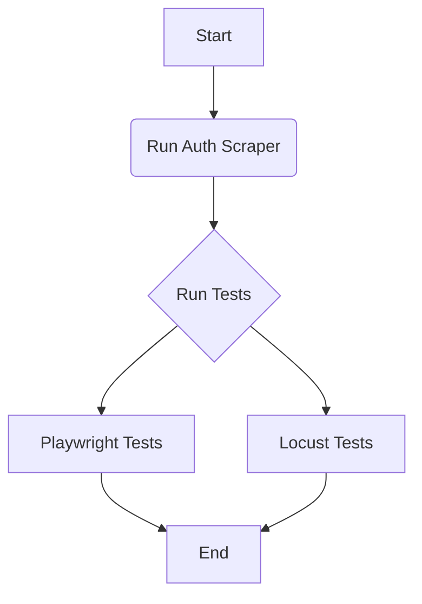
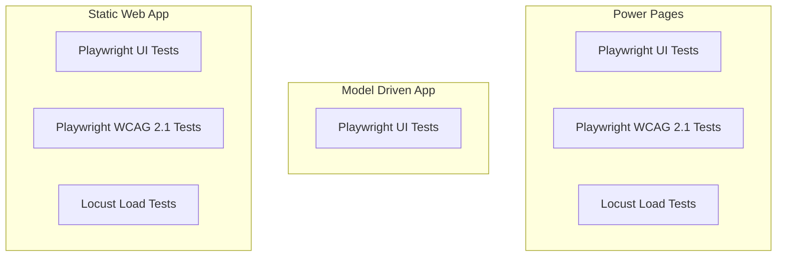

# Power Platform Automated Test Framework

This document outlines the automated testing framework for the Power Platform solution, covering the scope, types of tests, tools used, and the different applications under test.

## Scope

The primary focus of this framework is on end-to-end (E2E) and system-level tests that simulate real user interactions and scenarios.

**Included:**
-   **UI Functional Tests:** Verifying the user interface of Power Pages, Model-Driven Apps, and Static Web Apps.
-   **API Tests:** Direct interaction with Dataverse and other backend APIs.
-   **Load/Performance Tests:** Assessing the system's performance under load.
-   **Accessibility Tests:** Ensuring compliance with WCAG 2.1 standards.

**Excluded:**
-   **Static Code Analysis:** Code quality and vulnerability scanning are handled by separate processes.
-   **Unit Tests:** While encouraged, unit tests for individual components (e.g., plugins, PCF controls) are outside the scope of this E2E framework.

## Types of tests

### Playwright UI Tests

We use [Playwright](https://playwright.dev/) for our UI tests. It's a modern, capable framework that allows us to write reliable end-to-end tests for our web applications. These tests run in real browsers and simulate user actions like clicking buttons, filling forms, and navigating between pages.

The tests are organized by application:
-   `tests/mda/`: Tests for the Model-Driven App.
-   `tests/portal/`: Tests for the Power Pages portal.
-   `tests/public-file/`: Tests for the Static Web App.

### Playwright WCAG 2.1 Tests

To ensure our applications are accessible to all users, we have incorporated accessibility testing into our framework. We use Playwright combined with accessibility testing libraries (like `axe-core`) to automatically check for compliance with the Web Content Accessibility Guidelines (WCAG) 2.1. These tests help identify issues related to screen readers, keyboard navigation, color contrast, and more.

### Locust Load Tests

For performance and load testing, we use [Locust](https://locust.io/), an open-source load testing tool. We define user behavior in Python code and swarm our system with millions of simultaneous users. This helps us understand how our applications behave under stress and identify performance bottlenecks.

The Locust test scripts are located in `load-tests/locustfiles/`. These tests are executed using Azure Load Testing for scalable, cloud-based load generation.

## Related tools

### Playwright Auth Scraper

A significant challenge in testing secure Power Platform applications is handling authentication. We have developed a custom "Auth Scraper" using Playwright. Before test runs, a setup script (`*.setup.ts`) runs a Playwright test that logs in as a real user. It then captures and saves the authentication state (cookies, local storage tokens) into a JSON file.

Subsequent Playwright tests can then load this file to start their session already authenticated, bypassing the login process for every test and speeding up execution significantly. Similarly, the Locust load tests read these JSON authentication files to run their scenarios as authenticated users.

This handles various authentication providers used across the applications:
-   Microsoft Entra ID (formerly Azure AD) for Model-Driven Apps.
-   Azure AD B2C for the Power Pages portal.
-   Custom authentication for the Static Web App.

The core logic for this can be seen in `helpers/playwright_auth.py` for Locust, which reads the saved JSON file, and the various `auth.*.setup.ts` files for Playwright which generate it.

### Faker API / Test Data Factories

To ensure our tests are robust and realistic, we need to generate consistent and varied test data. We use a combination of a public API for generating fake data, [FakerAPI](https://fakerapi.it/), and a local factory pattern.

#### How to use FakerAPI

FakerAPI is a free-to-use REST API that provides fake data for testing purposes. You can request specific types and quantities of data by constructing a URL. For example, to get one male person's data, you would make a GET request to:

`https://fakerapi.it/api/v1/persons?_quantity=1&_gender=male`

The API documentation on their website provides a full list of available data types and parameters. Within our framework, our test factories abstract this away, so you can simply call a function like `CaseFactory.create()` and it will handle fetching the required fake data.

### Dataverse API

While UI tests are essential, interacting directly with the Dataverse API can be more efficient for setting up test data or verifying backend state. Our framework includes helpers (`tests/mda/utils/WebApi.ts` and `tests/mda/utils/XrmHelper.ts`) that provide a convenient way to perform CRUD (Create, Read, Update, Delete) operations on Dataverse records directly from our tests. This is often used for test setup and teardown.

### Azure DevOps Pipelines

All our tests are integrated into our CI/CD process using Azure DevOps Pipelines. The pipeline definition in `pipeline/automatedTesting.yml` orchestrates the entire process:
1.  Installs dependencies.
2.  Runs the Playwright authentication scrapers.
3.  Executes the Playwright UI and accessibility tests in parallel.
4.  Publishes test results and artifacts.
5.  Triggers the Azure Load Testing service to run the Locust tests.

This ensures that every change is automatically tested, providing fast feedback to the development team.

### Azure Load Testing

We use [Azure Load Testing](https://azure.microsoft.com/en-us/products/load-testing) to run our Locust-based load tests at scale. By integrating our Locust scripts with Azure Load Testing, we can simulate traffic from various geographic locations and generate a high load that would be difficult to achieve with on-premises infrastructure. The service provides detailed dashboards and metrics to analyze the performance results.

## What tests are appropriate to which platform

Different platforms have different architectures and user bases, so we tailor our testing strategy accordingly.

### On the Power Pages (Portal)

The portal is the primary interface for external users. Testing here focuses on public accessibility, performance under load, and the user journey for interacting with Dataverse.

-   **Playwright UI Tests:** Essential for validating end-to-end user scenarios, such as a member of the public registering for an account, filling out a multi-step form, uploading documents, and viewing their submitted data. These tests ensure the core business functions offered through the portal are working as expected.
-   **Playwright WCAG 2.1 Tests:** As a public-facing application, the portal must be accessible. These automated tests provide the first line of defense against accessibility regressions, ensuring the site is usable for people with disabilities.
-   **Locust Load Tests:** We simulate high-traffic scenarios to ensure the portal remains responsive and stable.
    -   **Concurrent users:** Measures the portal's ability to handle many simultaneous visitors browsing pages, which tests caching and page load performance.
    -   **File Uploads to Portal Web API:** Stresses the backend storage and Dataverse file handling capabilities by simulating many users uploading documents at once.
    -   **Submissions and updates via Portal Web API:** Tests the performance of custom components that interact with Dataverse directly, ensuring the API endpoints can handle a high volume of create and update operations.
    -   **Submissions and updates via Portal Standard Forms:** Tests the performance of out-of-the-box forms, which is crucial for ensuring basic data entry workflows are scalable.

### Model Driven Apps

MDAs are used by internal staff to manage business processes. Testing focuses on the correctness of business logic, data integrity, and complex user workflows within the standard Dynamics 365 interface.

-   **Playwright UI Tests:** These are the primary tests for MDAs. They validate critical internal processes like case management, approvals, and data administration. Tests will navigate through Business Process Flows, interact with complex forms containing sub-grids, and verify that security roles correctly alter the UI and available actions for different users. Load testing is generally less of a concern as user numbers are predictable and the platform is managed by Microsoft.

### Static Web App (Public File)

The Static Web App is a public-information site. Testing priorities are content availability, accessibility, and the ability to handle traffic spikes.

-   **Playwright UI Tests:** Verify that all pages load correctly, key information is present, navigation links work, and any interactive elements (like a search bar) are functional.
-   **Playwright WCAG 2.1 Tests:** Crucial for any public-facing government service to ensure it is accessible to all citizens.
-   **Locust Load Tests:**
    -   **Concurrent users:** Simulates a high number of users accessing the site simultaneously, for example, following a press release. This ensures the hosting infrastructure and any backend APIs it calls can withstand sudden peaks in traffic.
