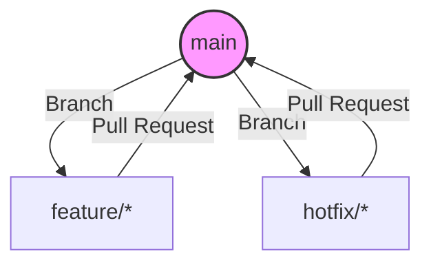

# Branching Strategy

This document outlines the branching strategy for this repository, which is based on a simple trunk-based development model. This model is designed for teams that practice continuous integration and aim for frequent releases.

## Main Branch

The repository has one single main branch:

-   `main`: This branch contains production-ready code. It should always be stable, tested, and deployable. All development starts from `main`, and all changes are eventually merged back into `main`. Direct commits to `main` are forbidden; all changes must come through a Pull Request.

## Supporting Branches

We use two types of supporting branches. These branches are short-lived and are deleted after being merged.

### Feature Branches

-   **Purpose:** For developing new features or making non-urgent bug fixes.
-   **Branch from:** `main`
-   **Merge back to:** `main` (via Pull Request)
-   **Naming convention:** `feature/<feature-name>` (e.g., `feature/add-case-creation-test`)

When a developer starts work, they create a feature branch from the latest `main`. Once the work is complete and has passed all tests, a pull request is created to merge it back into `main`.

### Hotfix Branches

-   **Purpose:** To quickly patch a critical bug in a production release.
-   **Branch from:** `main`
-   **Merge back to:** `main` (via Pull Request)
-   **Naming convention:** `hotfix/<issue-description>` (e.g., `hotfix/fix-portal-login-bug`)

If a critical bug is discovered in production, a `hotfix` branch is created from `main`. Once the fix is complete and verified, it is merged back into `main` to patch production.

## Workflow Diagram

## Pull Request (PR) Policy

-   All merges into `main` must be done via a Pull Request.
-   PRs should have a clear, descriptive title and a summary of the changes.
-   PRs must be reviewed and approved by at least one other team member before merging.
-   All automated tests must pass before a PR can be merged.
