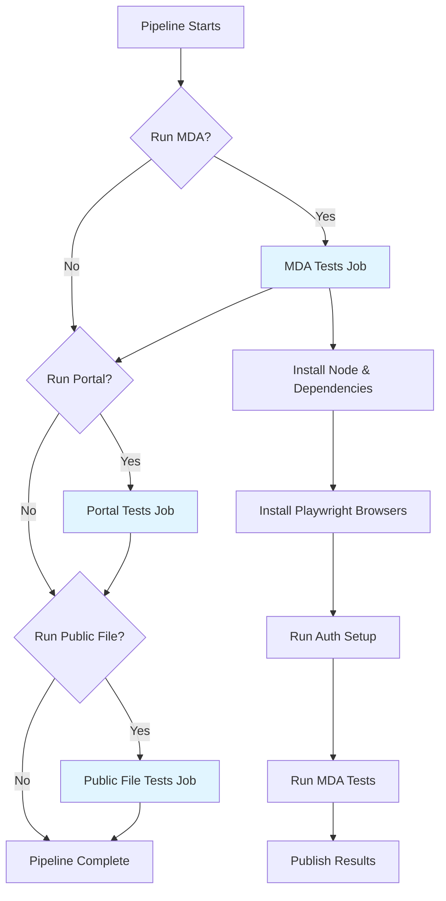

# Azure DevOps Pipeline Setup

This guide covers the Azure DevOps pipeline configuration for running Playwright tests in CI/CD. The pipeline is designed to run tests for three Power Platform applications: Model-Driven App (MDA), Power Pages Portal, and Public File Static Web App.

## Pipeline Architecture

The pipeline uses a **template-based approach** with reusable job templates to run tests for different applications. This provides:

- **Consistency**: All test jobs follow the same pattern
- **Maintainability**: Changes to test execution logic only need to be made in one place
- **Flexibility**: Easy to add new test suites or applications
- **Parallelization**: Tests for different applications can run simultaneously

## File Structure

```
pipeline/
├── automatedTesting.yml           # Main pipeline definition
└── templates/
    └── test-job-template.yml      # Reusable job template
```

## Main Pipeline Configuration

### File: `pipeline/automatedTesting.yml`

#### Triggers

The pipeline is triggered by:

1. **Upstream Pipeline Trigger**: Via a dependency on the `minimal-trigger` pipeline
   ```yaml
   resources:
     pipelines:
     - pipeline: minimal-trigger
       source: minimal-trigger
       trigger:
         branches:
           include:
           - main
   ```
   
   ⚠️ **Important**: The `minimal-trigger` pipeline is a **placeholder** that was created to mimic the development team's actual build pipeline (which was not made available). In production, you should replace `minimal-trigger` with the name of your actual dev team pipeline. This allows the test suite to run automatically whenever their pipeline completes successfully.

2. **Code Changes**: Automatically when tests are modified
   ```yaml
   trigger:
     branches:
       include:
         - main
     paths:
       include:
         - tests/*
       exclude:
         - README.md
         - pipelines/*
   ```

#### Runtime Parameters

The pipeline provides **runtime parameters** that appear as checkboxes in the Azure DevOps UI when you manually run the pipeline:

```yaml
parameters:
  - name: runMDA
    displayName: "Run MDA Tests"
    type: boolean
    default: true

  - name: runPortal
    displayName: "Run Portal Tests"
    type: boolean
    default: true

  - name: runPublicFile
    displayName: "Run Public File Tests"
    type: boolean
    default: true
```

**How This Works:**

- **Manual Runs**: When you click "Run pipeline" in Azure DevOps, you'll see three checkboxes. Uncheck any test suite you want to skip.
- **Automatic Triggers**: When triggered by code changes or the upstream pipeline, all three test suites run by default (`default: true`).
- **Selective Testing**: During development, you can run only the tests affected by your changes, reducing execution time.

**Use Cases:**
- ✅ Skip Portal tests when only MDA code changed
- ✅ Run only Public File tests for quick validation
- ✅ Test a single application during debugging
- ✅ Reduce costs by only running necessary tests

#### Agent Configuration

```yaml
pool:
  vmImage: windows-latest
```

**Important**: Tests run on Windows agents. While Playwright supports multiple platforms, the current configuration uses Windows for consistency with the development environment.

## Job Template

### File: `pipeline/templates/test-job-template.yml`

The template is a reusable job definition that handles:

1. **Environment Setup**
   - Checks out code
   - Installs Node.js 20.x
   - Installs npm dependencies
   - Installs Playwright browsers

2. **Test Execution**
   - Sets environment variables
   - Installs Playwright Chromium browser
   - Runs the specified test script

3. **Results Publishing**
   - Publishes JUnit test results
   - Publishes HTML test reports as artifacts
   - Publishes videos and screenshots as artifacts

### Template Parameters

```yaml
parameters:
  - name: jobName           # Unique identifier for the job
  - name: displayName       # Human-readable name shown in Azure DevOps
  - name: testScript        # npm script to execute (e.g., "npm run test:mda")
  - name: environmentVariables  # Key-value pairs of environment variables
```

### Environment Variables

The template automatically injects these variables for every test run:

**CI/CD Variables:**
```yaml
CI: "true"                              # Indicates tests are running in CI
```

**Azure Test Plans Integration:**
```yaml
AZURE_DEVOPS_ORG_URL: $(AzureDevOpsOrgUrl)
AZURE_DEVOPS_TOKEN: $(AzureDevOpsToken)
AZURE_TEST_PLAN_ID: $(AzureTestPlanId)
AZURE_PROJECT_NAME: $(AzureProjectName)
```

**Application-Specific Variables** (passed via parameters):
```yaml
MDA_URL: $(MDA_URL)
APP_NAME: $(APP_NAME)
O365_USERNAME: $(O365Username)
O365_PASSWORD: $(O365Password)
```

## Test Suite Configuration

### MDA Tests

```yaml
- ${{ if eq(parameters.runMDA, true) }}:
    - template: templates/test-job-template.yml
      parameters:
        jobName: "MDA_Tests"
        displayName: "Run MDA Tests"
        testScript: "npm run test:mda"
        environmentVariables:
          MDA_URL: "$(MDA_URL)"
          APP_NAME: "$(APP_NAME)"
          O365_USERNAME: "$(O365Username)"
          O365_PASSWORD: "$(O365Password)"
```

**Required Variables:**
- `MDA_URL`: URL of the Model-Driven App
- `APP_NAME`: Name of the app to open
- `O365Username`: Microsoft 365 username
- `O365Password`: Microsoft 365 password (stored as secret)

### Portal Tests

```yaml
- ${{ if eq(parameters.runPortal, true) }}:
    - template: templates/test-job-template.yml
      parameters:
        jobName: "Portal_Tests"
        displayName: "Run Portal Tests"
        testScript: "npm run test:portal"
        environmentVariables:
          PORTAL_URL: "$(PORTAL_URL)"
          B2C_USERNAME: "$(B2C_USERNAME)"
          B2C_PASSWORD: "$(B2C_PASSWORD)"
```

**Required Variables:**
- `PORTAL_URL`: URL of the Power Pages portal
- `B2C_USERNAME`: Azure AD B2C username
- `B2C_PASSWORD`: Azure AD B2C password (stored as secret)

### Public File Tests

```yaml
- ${{ if eq(parameters.runPublicFile, true) }}:
    - template: templates/test-job-template.yml
      parameters:
        jobName: "PublicFile_Tests"
        displayName: "Run Public File Tests"
        testScript: "npm run test:public-file"
        environmentVariables:
          AZURE_APP_URL: "$(AZURE_APP_URL)"
          AZURE_PASSWORD: "$(AZURE_PASSWORD)"
          PORTAL_URL: "$(PORTAL_URL)"
```

**Required Variables:**
- `AZURE_APP_URL`: URL of the static web app
- `AZURE_PASSWORD`: Azure authentication password (stored as secret)
- `PORTAL_URL`: Portal URL (for verification)

## Setting Up the Pipeline

### Step 1: Create Pipeline Variables

In Azure DevOps, navigate to **Pipelines** → **Library** and create a variable group or add variables directly to your pipeline:

**Azure Test Plans Variables:**
- `AzureDevOpsOrgUrl`: Your Azure DevOps organization URL (e.g., `https://dev.azure.com/your-org`)
- `AzureDevOpsToken`: Personal Access Token with Test Plans read/write permissions
- `AzureTestPlanId`: ID of your test plan (numeric) - **Note**: This can be overridden at runtime when manually running the pipeline
- `AzureProjectName`: Name of your Azure DevOps project

**MDA Variables:**
- `MDA_URL`: Your Model-Driven App URL
- `APP_NAME`: Your app's unique name
- `O365Username`: Microsoft 365 username
- `O365Password`: Microsoft 365 password ⚠️ **Mark as secret**

**Portal Variables:**
- `PORTAL_URL`: Your Power Pages portal URL
- `B2C_USERNAME`: Azure AD B2C username
- `B2C_PASSWORD`: Azure AD B2C password ⚠️ **Mark as secret**

**Public File Variables:**
- `AZURE_APP_URL`: Your static web app URL
- `AZURE_PASSWORD`: Azure authentication password ⚠️ **Mark as secret**

### Step 2: Import the Pipeline

1. In Azure DevOps, go to **Pipelines** → **New Pipeline**
2. Select your repository
3. Choose "Existing Azure Pipelines YAML file"
4. Select `/pipeline/automatedTesting.yml`
5. Save and run

### Step 3: Configure the Upstream Pipeline

The main pipeline depends on an upstream pipeline trigger. Currently, it references `minimal-trigger`, which is a **placeholder**.

#### Current Placeholder Configuration

```yaml
# minimal-trigger.yml (PLACEHOLDER - REPLACE IN PRODUCTION)
trigger: none  # Manual trigger only

pool:
  vmImage: ubuntu-latest

steps:
  - script: echo "Triggering automated tests"
    displayName: "Minimal Trigger"
```

This minimal pipeline was created to mimic the development team's actual build pipeline, which was not made available during initial setup.

#### Production Configuration

**To integrate with your actual dev pipeline:**

1. Identify the name of the development team's build pipeline
2. Update `pipeline/automatedTesting.yml`:
   ```yaml
   resources:
     pipelines:
     - pipeline: dev-team-build  # Replace with actual pipeline name
       source: YourActualPipelineName  # Replace with actual pipeline name
       trigger:
         branches:
           include:
           - main
   ```

3. Remove or keep the `minimal-trigger` pipeline for manual testing purposes

**Why This Matters**: When properly configured, your test pipeline will automatically run whenever the dev team's pipeline completes successfully, ensuring tests run against every build.

## Runtime Configuration

When you **manually run the pipeline** from the Azure DevOps UI, you have additional configuration options beyond the static pipeline variables.

### Selecting Test Suites

When you click "Run pipeline" in Azure DevOps, you'll see the pipeline parameters as checkboxes:

```
┌─────────────────────────────────────────┐
│ Run pipeline: automatedTesting          │
├─────────────────────────────────────────┤
│ Branch/tag: main                        │
│                                         │
│ Parameters:                             │
│ ☑ Run MDA Tests                        │
│ ☑ Run Portal Tests                     │
│ ☑ Run Public File Tests                │
│                                         │
│ [Variables ▼]                           │
│                                         │
│           [Cancel]  [Run] ─────────────>│
└─────────────────────────────────────────┘
```

Uncheck any suite you want to skip for this run. This is useful for:
- Quick validation of a single application
- Debugging specific test failures
- Reducing execution time during development
- Cost optimization by only running necessary tests

### Overriding Variables at Runtime

You can also override pipeline variables for a single run:

1. Click "Run pipeline"
2. Click "Variables" to expand the variables section
3. Override any variable value (e.g., change `AzureTestPlanId` to test against a different test plan)
4. Click "Run"

**Common Runtime Overrides:**
- `AZURE_TEST_PLAN_ID`: Test against a different test plan (e.g., for a specific sprint)
- `MDA_URL`, `PORTAL_URL`, `AZURE_APP_URL`: Test against different environments (dev, staging, prod)
- Environment-specific credentials for testing in non-production environments

**Example Use Case**: You want to run only MDA tests against a staging environment with a different test plan:
1. Uncheck "Run Portal Tests" and "Run Public File Tests"
2. Override `MDA_URL` with your staging URL
3. Override `AZURE_TEST_PLAN_ID` with your staging test plan ID
4. Click "Run"

### Automatic vs. Manual Execution

| Trigger Type | Test Suite Selection | Variable Source |
|--------------|---------------------|-----------------|
| **Automatic** (code changes or upstream pipeline) | All three test suites run (`default: true`) | Pipeline variables |
| **Manual** (UI) | Select via checkboxes | Pipeline variables + runtime overrides |

## Test Execution Flow

When the pipeline runs, this sequence occurs:



### Within Each Job

1. **Checkout**: Repository code is checked out
2. **Node Setup**: Node.js 20.x is installed
3. **Dependencies**: `npm ci` installs dependencies
4. **Browser Install**: `npx playwright install chromium` downloads browsers
5. **Test Execution**: Test script runs with environment variables
6. **Results Publishing**:
   - JUnit XML results are published to Azure Test Plans
   - HTML reports are saved as artifacts
   - Videos and screenshots are saved as artifacts

## Published Artifacts

After each test run, the following artifacts are available:

### Test Reports

**Location**: `{JobName}-results` artifact
**Contains**:
- `playwright-report/`: HTML test report
- `index.html`: Main report page
- Test results with screenshots and traces

### Test Videos and Screenshots

**Location**: `{JobName}-videos` artifact  
**Contains**:
- Video recordings of test executions
- Screenshots on test failures
- Trace files for debugging

### Accessing Artifacts

1. Go to the pipeline run in Azure DevOps
2. Click on the job (e.g., "MDA_Tests")
3. Look for "Published" section in the summary
4. Download artifacts for offline review

## Integration with Azure Test Plans

The pipeline uses the `@alex_neo/playwright-azure-reporter` to sync results with Azure Test Plans. This provides:

- **Automatic Test Case Matching**: Tests are matched to Test Plan cases by title
- **Test Result Publishing**: Pass/fail results are recorded in Test Plans
- **Attachment Upload**: Screenshots, videos, and traces are attached to test results
- **Test Run Summary**: Unmatched tests are reported in `test-case-summary.md`

### Configuration

Test Plans integration is configured in `playwright.config.ts`:

```typescript
reporter: [
  '@alex_neo/playwright-azure-reporter',
  {
    orgUrl: process.env.AZURE_DEVOPS_ORG_URL,
    token: process.env.AZURE_DEVOPS_TOKEN,
    planId: parseInt(process.env.AZURE_TEST_PLAN_ID),  // Configurable at runtime
    projectName: process.env.AZURE_PROJECT_NAME,
    publishTestResultsMode: 'testRun',
    uploadAttachments: true,
    testCaseSummary: {
      enabled: true,
      outputPath: 'test-case-summary.md'
    }
  }
]
```

**Runtime Configuration**: The `AZURE_TEST_PLAN_ID` can be overridden when manually running the pipeline, allowing you to:
- Test against different test plans (e.g., Sprint 1 vs. Sprint 2)
- Separate results by environment (dev test plan vs. staging test plan)
- Run experiments without affecting the main test plan

## Troubleshooting

### Tests Fail to Run

**Issue**: Tests don't execute or immediately fail  
**Possible Causes**:
- Missing or incorrect environment variables
- Authentication credentials expired
- Browser installation failure

**Solution**:
1. Check pipeline logs for the "Run Tests" step
2. Verify all required variables are set in Azure DevOps
3. Ensure secret variables are not accidentally revealed (they'll show as `***`)
4. Check that browser installation completed successfully

### Authentication Failures

**Issue**: Tests fail during login  
**Possible Causes**:
- Incorrect credentials
- MFA requirements
- Password changed but not updated in Azure DevOps

**Solution**:
1. Verify credentials work in a browser
2. Ensure MFA is not required (use app passwords if necessary)
3. Update variables in Azure DevOps if credentials changed
4. Check the `auth/*.setup.ts` files for authentication logic

### Artifacts Not Published

**Issue**: Test reports or videos are missing  
**Possible Causes**:
- Test execution failed before artifacts were created
- Path configuration is incorrect
- Insufficient permissions

**Solution**:
1. Check the "Publish Test Reports" step in pipeline logs
2. Verify the `playwright-report` directory exists
3. Ensure the job completed (even with test failures)
4. Check the `continueOnError: true` setting is in place

### Pipeline Doesn't Trigger

**Issue**: Code changes don't trigger the pipeline  
**Possible Causes**:
- Changes were in excluded paths
- Branch name doesn't match trigger configuration
- Upstream pipeline (minimal-trigger) doesn't exist or is misconfigured
- Upstream pipeline name doesn't match the actual dev team pipeline

**Solution**:
1. Verify changes are in the `tests/*` directory
2. Check that you're pushing to the `main` branch
3. If using `minimal-trigger` placeholder, create it as documented in Step 3
4. **Production environments**: Replace `minimal-trigger` with your actual dev team pipeline name
5. Verify the upstream pipeline completes successfully before expecting tests to trigger
6. Manually trigger the pipeline to test

### Test Results Not in Azure Test Plans

**Issue**: Tests run successfully but don't appear in Test Plans  
**Possible Causes**:
- Azure DevOps token lacks permissions
- Test Plan ID is incorrect
- Test case matching failed

**Solution**:
1. Verify `AZURE_DEVOPS_TOKEN` has Test Plans write permissions
2. Check `AZURE_TEST_PLAN_ID` matches your actual plan ID
3. Review `test-case-summary.md` artifact for unmatched tests
4. Ensure test titles match Test Case titles exactly

## Running Locally vs. Pipeline

### Differences

| Aspect | Local | Pipeline (Automatic) | Pipeline (Manual) |
|--------|-------|---------------------|-------------------|
| **Browser** | Configurable | Chromium only | Chromium only |
| **Parallelization** | Unlimited | Limited to 1 worker | Limited to 1 worker |
| **Retries** | 0 | 2 retries on failure | 2 retries on failure |
| **Environment** | `.env` file | Azure DevOps variables | Azure DevOps variables + runtime overrides |
| **Reports** | Opens automatically | Saved as artifacts | Saved as artifacts |
| **Test Selection** | Command line | All 3 apps (default) | Choose via checkboxes |
| **Test Plan** | Local config | Pipeline variable | Configurable at runtime |

### Environment Variable Mapping

**Local** (`.env` file):
```bash
MDA_URL=https://...
O365_USERNAME=user@domain.com
O365_PASSWORD=...
```

**Pipeline** (Azure DevOps variables):
```yaml
environmentVariables:
  MDA_URL: "$(MDA_URL)"
  O365_USERNAME: "$(O365Username)"
  O365_PASSWORD: "$(O365Password)"
```

## Best Practices

### Security

1. **Never commit credentials**: Always use Azure DevOps variables
2. **Mark passwords as secret**: Use the lock icon in variable configuration
3. **Rotate tokens regularly**: Update Personal Access Tokens every 90 days
4. **Use service accounts**: Don't use personal accounts for automated testing
5. **Audit access**: Review who can view/edit pipeline variables

### Performance

1. **Use selective execution**: Only run affected test suites during development
2. **Parallelize when possible**: Run independent test suites simultaneously
3. **Optimize test data**: Use factories to quickly generate test data
4. **Clean up resources**: Delete test records to prevent database bloat
5. **Monitor execution time**: Track trends to identify performance degradation

### Maintenance

1. **Keep browsers updated**: Playwright updates frequently - stay current
2. **Review failed tests**: Don't ignore flaky tests - fix them
3. **Update documentation**: Keep this guide in sync with pipeline changes
4. **Version pipeline files**: Track changes to YAML files in source control
5. **Monitor artifact size**: Large artifacts can slow down pipelines

## Adding New Test Suites

To add a new test suite to the pipeline:

1. **Create npm script** in `package.json`:
   ```json
   {
     "scripts": {
       "test:new-app": "npx playwright test --project=new-app-tests"
     }
   }
   ```

2. **Add parameter** to `automatedTesting.yml`:
   ```yaml
   parameters:
     - name: runNewApp
       displayName: "Run New App Tests"
       type: boolean
       default: true
   ```

3. **Add job** to `automatedTesting.yml`:
   ```yaml
   - ${{ if eq(parameters.runNewApp, true) }}:
       - template: templates/test-job-template.yml
         parameters:
           jobName: "NewApp_Tests"
           displayName: "Run New App Tests"
           testScript: "npm run test:new-app"
           environmentVariables:
             NEW_APP_URL: "$(NEW_APP_URL)"
             NEW_APP_USERNAME: "$(NEW_APP_USERNAME)"
             NEW_APP_PASSWORD: "$(NEW_APP_PASSWORD)"
   ```

4. **Add variables** to Azure DevOps:
   - Navigate to your pipeline
   - Click "Edit" → "Variables"
   - Add new variables for the test suite

5. **Test locally first**: Ensure tests work locally before adding to pipeline

## Related Documentation

- [Authentication Setup](./authentication.md) - Details on how authentication works
- [Testing Guide](./testing-guide.md) - How to write and organize tests
- [Framework Components](./framework-components.md) - Understanding the test framework

## Additional Resources

- [Azure Pipelines YAML Schema](https://docs.microsoft.com/en-us/azure/devops/pipelines/yaml-schema)
- [Playwright CI Documentation](https://playwright.dev/docs/ci)
- [Azure DevOps Variables](https://docs.microsoft.com/en-us/azure/devops/pipelines/process/variables)
- [Azure Test Plans Integration](https://github.com/alex-neo/playwright-azure-reporter)